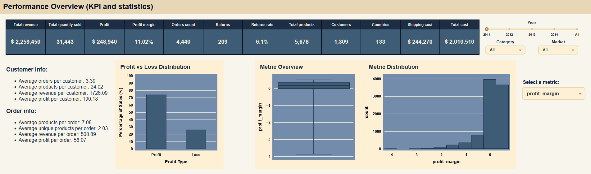
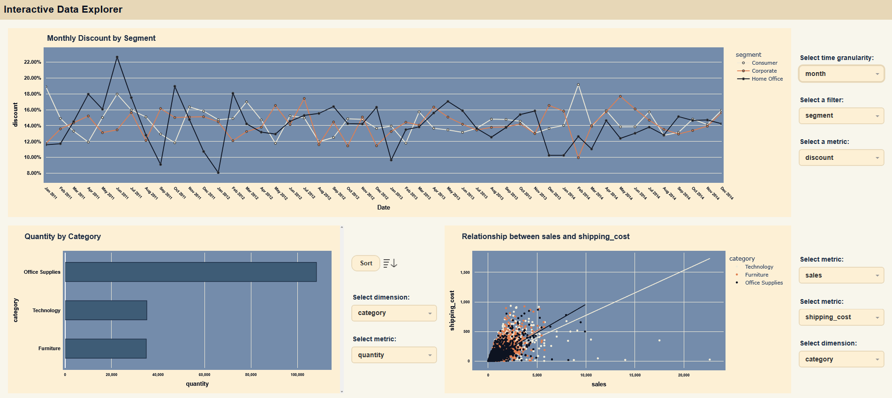
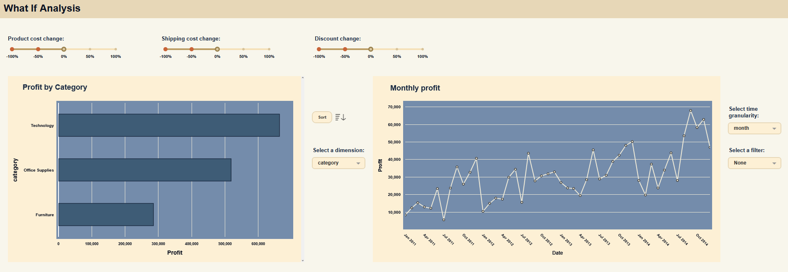
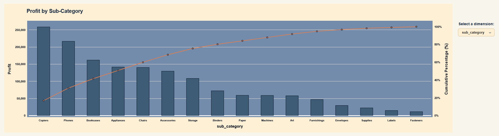

# Global Superstore Dashboard

An interactive business intelligence dashboard built with Dash and Plotly for exploring sales performance, profitability, customer behavior, and what-if business simulations using the Global Superstore dataset, a fictional online store used for educational purposes. The project is divided into two notebooks:
### First Notebook: Data Processing & Analysis
I collected the data from an Excel file, then cleaned and processed it. To make the analysis more complex, I created new columns based on the existing data. I also optimized the dataframe by using the correct data types for each series. After cleaning, I performed a simple analysis using Pandas aggregation functions. This helped me discover interesting facts about the data, such as potential typos, outliers, inconsistencies and important relationships and key business patterns across categories, countries, customers, and markets.
### Second Notebook: Interactive Dashboard

I built a complex dashboard using `Dash` and `Plotly`. This dashboard includes:
- _Key Performance Indicators (KPIs)_, a histogram, and a boxplot for basic statistics;
- _Dynamic Charts_: A line chart for trends over time, a bar chart for comparisons, and a scatter plot with a correlation line to show relationships;
- _Full Interactivity_: You can apply filters and change metrics for a more precise analysis.
### Final Section: What-If Analysis
I included a _"What-If" analysis_ with three sliders to modify discounts, product costs, and shipping costs. 

Finally, I created a _Pareto Chart_ (combining a bar chart and a line chart) to show the most important factors in the business.

---

## Setup

- Python 3.10+, dash 3.3.0, plotly 6.4.0
- Installing the required libraries:
    + All the libraries required for this project are listed in the `requirements.txt` file.
    + In the same folder, there is a `install_requirements.bat` file that can be run to automatically install all required libraries.
    + Alternatively, you can run: `py -m pip install -r requirements.txt`
    + If you are using Anaconda, these libraries can also be installed directly through Anaconda Navigator.
- Jupyter Notebook is required to run the notebooks:
    + Can be installed from the official website: https://jupyter.org/install
    + Or via Anaconda: https://www.anaconda.com/download
    + Alternatively, you can use VS Code with the recommended extensions (listed in `.vscode/extensions.json`)

---

## Data Sources

The data was downloaded from Kaggle: https://www.kaggle.com/datasets/shekpaul/global-superstore

---

## Running the Project

1. **Data processing & data analysis**  
    - Notebook: `notebooks/01_data_processing_and_analysis.ipynb`  
    - This notebook reads the file from `data/raw/Global Superstore.xlsx`, cleans, processes, and analyzes the data, then saves it in `data/processed/`.  

2. **Data Visualization**  
    - Notebook: `notebooks/02_data_visualization.ipynb`  
    - Using the cleaned and processed data, this notebook creates the dashboard.  
    - Must be run after `01_data_processing_and_analysis.ipynb`.
      
_**Once the script is running, you can access the dashboard by opening http://127.0.0.1:8050 in your web browser**_

---

